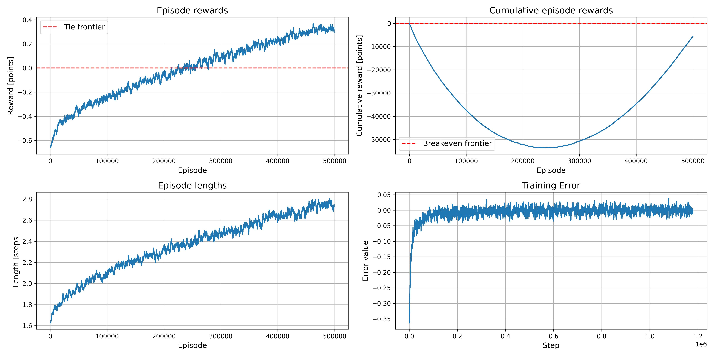
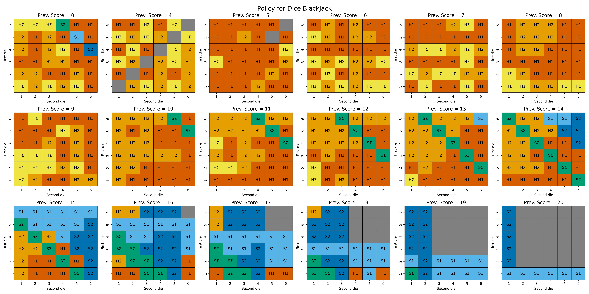

# Blackjack, Markov and two dice


There is nothing better to win over the casino. Especially in Blackjack, where you literally play against the dealer. So, we decided to train the Q-Learning agent, that can make the dealer feel uncanny.

## Installation

Before installing the project make sure that you have already installed [poetry](https://pypi.org/project/poetry/) for the dependencies management. 

Also make sure, that your Poetry create the local virtual environment `.venv` in your project's folder.

```shell
poetry config virtualenvs.in-project true
```

After configuring the Poetry, clone the repository and launch the installation.

```shell
git clone git@github.com:Makkarik/dice-blackjack-mdp.git
cd dice-blackjack-mdp
poetry install
```
## Training Environment

The Balckjack game is the game, that use a pair of dice instead of cards as a source of randomness. To get familiar with the game rules, you may see the original source at this [link](https://www.chessandpoker.com/dice_blackjack.html).

The Dice Blackjack has a state vector $\bold{s} = [p, d_1, d_2] \in \mathbb{S}$, 

where:

$p \in [0, 27] \subset \mathbb{N}_0$ - the sum of the previous rolls;

$d_1, d_2 \in [0, 6] \subset \mathbb{N}_0$ - the rolled values of first and second die (0 value is used to indicate final states, when no rolling is available).

The action space consists of 6 actions: 

0 - hit the first die (**H1**);
1 - hit the second die (**H2**);
2 - hit the sum (**HΣ**);

3 - stack the first die (**S1**);
4 - stack the second die (**S2**);
5 - stack the sum (**SΣ**).

The game ends with on of four possible rewards:

-1 - the player got busted (scored more than 21 points) or got less points than the dealer;
0 - the game ended with a tie;
1 - the player won over the dealer or dealer got busted;
2 - the player rolled a Blackjack combination (2 double values in first two rolls).

You may play the game by launching the environment file `/src/env.py` directly.

## Training

You may reproduce the results by launching the `Training.ipynb` notebook.

We have trained the agent for 400.000 episodes with non-linear $\varepsilon$ decay.



It is noticable, that the acquired policy is strong enough to get the positive feedback from the game (average reward greater than 0). To make the policy human-readable, we have converted the Q-table to the Dice Blackjack cheatsheet with all possible cases.

The cells colored in gray designated the states with either no available actions or not encountered yet (heatmap for score of 5). 



You may use the cheatsheet and play the game manually to check, if the policy is good enough or not.

## Code style

The repository is equipped with pre-commit hooks for autoamtic code linting. All the code style requirements are listed in `[tool.ruff.lint]` section of `pyproject.toml` file. 

For better experince, use the VS Code IDE with the installed Ruff extension.
